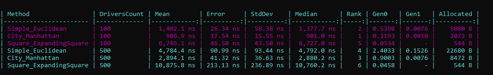
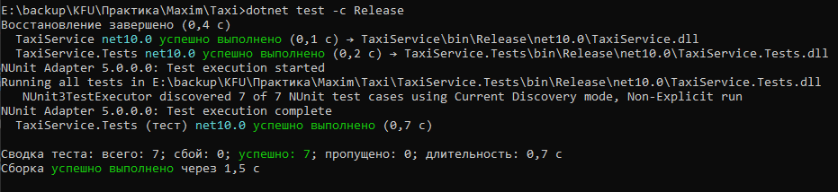

Проект реализует механизм подбора ближайших водителей к заказу.

## Реализованные алгоритмы
1. Алгоритм 1: SimpleSearch - Находит 5 ближайших водителей, используя Евклидово расстояние (прямое расстояние между двумя точками).
2. Алгоритм 2: CitySearch - Находит 5 ближайших водителей, используя "Манхэттенское расстояние" (расстояние, которое можно пройти в городе с квадратной сеткой улиц).
3. Алгоритм 3: SquareSearch - ходит 5 ближайших водителей, используя поиск по расширяющимся квадратам.

## Результаты бенчмарков


## Тестирование


## Запуск
Клонируем репозиторий (git clone)
```sh
cd Maxim_practic 
```
Запуск тестов
```sh
dotnet test
```
Запуск бенчмарка
```sh
cd TaxiService
dotnet run -c Release
```